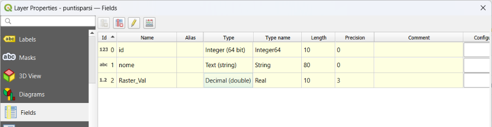
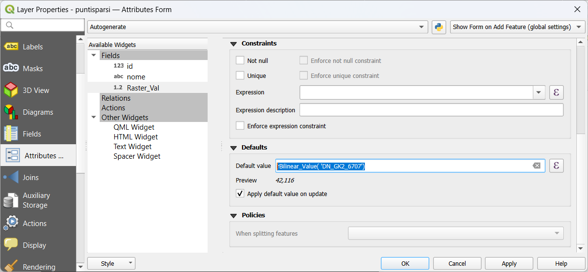
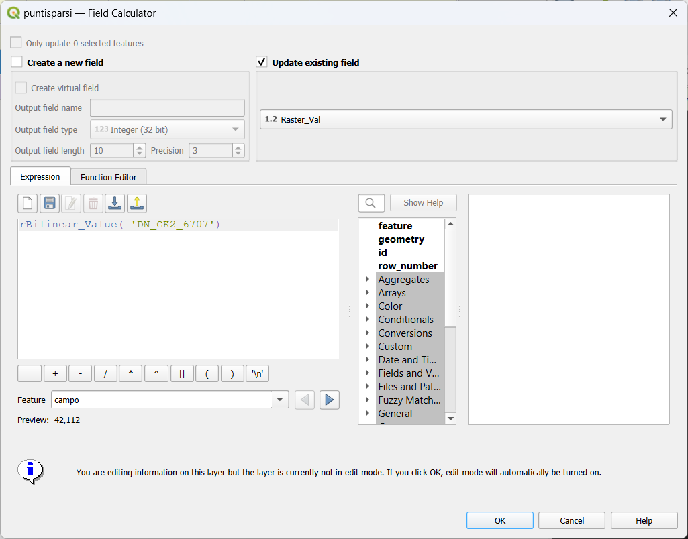
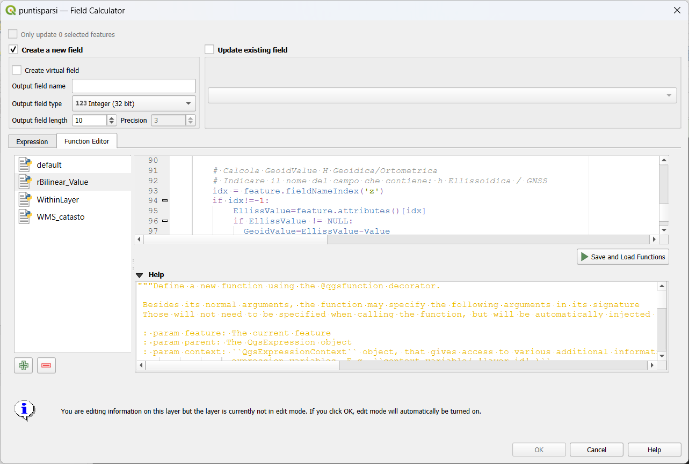

# GK2_to_ITALGEO2005
Estrazione dai Grigliati IGMI GK2 del Modello di Ondulazione del Geoide ITALGEO2005

da Altezze Ellissoidiche ---> a Quote Ortometriche/Geoidiche

Vertical Geoid Model utilizzabile con i software di controllo 
dei ricevitori satellitari GNSS 
 
Vertical Geoid Model con QGIS.

# Esempio operativo per l'uso di rBilinear_Value.py

La funzione **rBilinear_Value.py** deve essere caricata in:

C:\\Users\\**MIOPROFILO**\\AppData\\Roaming\\QGIS\\QGIS3\\profiles\\default\\python\\expressions

Il file raster da dove estrarre i valori con la funzione
**rBilinear_Value** deve avere lo stesso sistema di proiezione del file
punti (devo ancora implementare nella funzione rBilinear_Value.py in
cambio di proiezione fra i due layers raster/point ):

Nell'ipotesi di due file con proiezione differente: DN_GK2.asc *(6706)*
e puntisparsi.shp *(6707)*

- o converti DN_GK2.asc *(6706)* in EPSG:6707 -🡪 DN_GK2_6707.tif (con il
comando Qgis: Export🡪Save as...)

- o converti puntisparsi.shp *(6707)* in EPSG:6706 -🡪 puntisparsi_6706.shp
(con il comando Qgis: Export🡪Save as...)

Nel mio caso ho preferito lavorare in EPSG:6707, creando il file
**DN_GK2_6707.tif** congruente con **puntisparsi.shp**

1)  In **puntisparsi.shp** ho inserito un nuovo campo **Raster_Val**
    (real)

2)  La funzione **rBilinear_Value** vuole come parametro di input il
    nome del file raster da usare nel calcolo, pertanto ho attribuito a
    **Raster_Val** l'espressione di default: **rBilinear_Value(
    \'DN_GK2_6707\')** abilitando anche: ***Apply default value on
    update*** (auto aggiornamento del campo nel caso di spostamento del
    punto)

3)  Per i punti già presenti in **puntisparsi.shp** ho usato **Field
    Calculator** con la stessa espressione: **rBilinear_Value(
    \'DN_GK2_6707\')**

Ulteriore utilizzo di **rBilinear_Value.py** nel caso in cui il file
raster rappresenti il **Modello di Ondulazione del Geoide** e nel file
**puntisparsi.shp** è presente il campo (Esempio: **H_ELL** ) con il
valore di altezza ellissoidica ricavata da un rilievo GNSS.

Se il file **puntisparsi.shp** è un **PointZ** posso estrarre il valore
di z con il **Fied Calculator** e attribuirlo al campo **z**:

- **z-🡪 *z(\$geometry)***

oppure:

- **H_ELL** **🡪 *z(\$geometry)***

In questo secondo caso devo modificare alla riga 93 della funzione
**rBilinear_Value.py** e sostituire: **z** con **H_ELL**

*( ricordarsi di usare il pulsante **Save and Load Functions** )*

Il risultato **rBilinear_Value** sarà la **Quota Geoidica** ( differenza
dei valori: ***[z - GeoidModelValue]*** o ***[H_ELL -
GeoidModelValue]*** )

Fine del lavoro......

Aprile 2024

Mauro Bettella

<bettellam@gmail.com>
